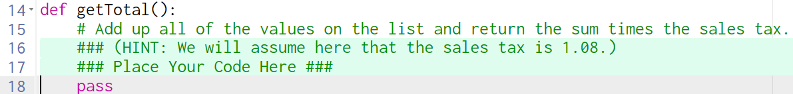
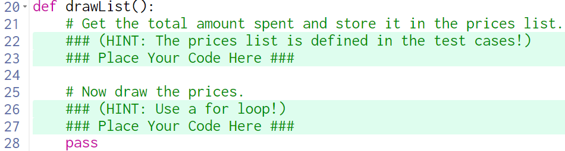

# Unit 10 Practice Quiz Guiding Questions

### Read the comments on lines 15 & 16 before proceeding
  

  
  
What is "the list"?

    
  > `app.prices`
 

  
How do you add up all of the values in the list?

  
  > 1. You need to create a local variable to hold the sum. Maybe call it `sum` and set it to `0`.  
  > 2. Loop through the list (see the previous question if you aren't sure what list) and add each price in the list to the sum.
  
  

  
How do you return a value?

  
 > Use the keyword `return` followed by the thing you want to return

  
What needs to be returned here?

  
> `sum * 1.08`

  
Should the return statement be inside of the loop or outside?

> outside

### Read the comments on lines 21 & 22 before proceeding

How do you get the total amount spent?

  
  > Call the helper function `getTotal` and store its return value in a variable.  Maybe call the variable `total`.
  
  

How do you store the return value in a variable?

    
  > `total = getTotal()`
  
  

What is the prices list?

  
> `app.prices`

How do you store something in a list?

  
> `listName.append(thingToStore)`
  
  

  

How do you store the total amount in the prices list?

  
> Assuming you created the local variable, `total`, `app.prices.append(total)`
  

### Read the comments on lines 25 & 26 before proceeding

What are the prices on the screen?

  
> Labels

What properties of the prices are changing?

  
> 1. `value`
> 2. `centerY`

Where is `value` coming from?

  
> `app.prices`

Where is `centerY` coming from?

  
> It starts at 130 and goes up by 40 each time

How can we get the `value` and the `centerY` in a single loop?

  
 > * Use `for i in range(len(app.prices))`.  
 > * Inside the loop create a Label setting its `value` to `app.prices[i]` and its `centerY` to `130+40*i` (set everything else by inspecting the solution).

Run your program.  How is it different from the solution?

  
> We're missing the $ in front of the price.

How do we fix that?

  
> One way would be to make a local variable before creating the label, call it `price`.  
> * Set the value of price to `'$' + str(app.prices[i])`
> * Change the value of the label to `price` (no quotes)

 

  
  
### If you followed my directions, you should have added 4 lines in getTotal(), and 5 lines in drawList() (in 2 separate sections).

### If it still doesn't work, go back through the guiding questions slowly and make sure you didn't skip anything. Read carefully.

  

  

  

  
  

  
